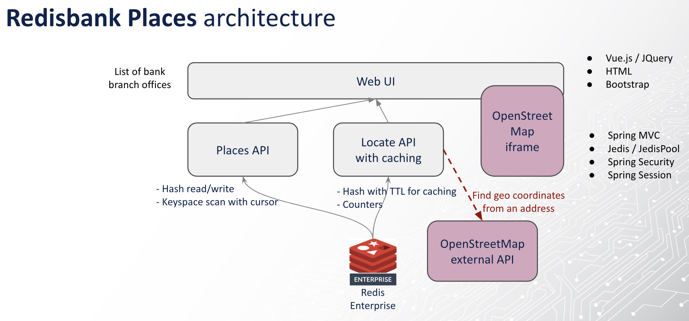
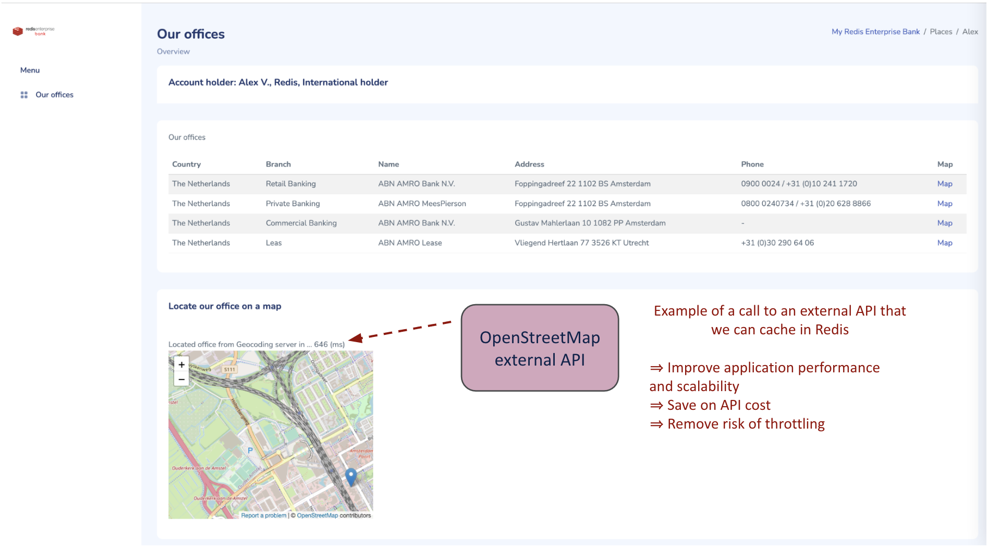

# About Redisbank Places

This application uses **Redis Stack** with Redis core data structures (Hashes, Time to live expiry, Hashes scans) to build a
Java/Spring Boot/Jedis application that loads a list of banking office addresses and uses a slow external API for geocoding
purpose and display the office location on a map. 
The 3rd party service is slow and might be rate limited or paid-for so is a scenario for using Redis as a cache to keep the geocoding information. 
UI in Bootstrap/CSS/Vue.

Features in **Redisbank Places**:

- **Jedis** for simple Java API for Redis with pool support
- **Redis Hashes** for simple object / key-value mapping and read/write/scans in Redis
- **Redis TTL** for time to live expiry on any Redis key
- **Redis counter** for atomic counter increments

> - The application is using the Spring framework in a very basic way only for the web/REST API and for running as standalone executable jar
> - The codebase is using plain Jedis API for Redis.
> - The UI and architecture is inspired from Lars' work with Redis Bank application https://github.com/Redislabs-Solution-Architects/redisbank/ 

# Architecture




# Getting Started

## Building and Running in Gitpod

Gitpod can spin up a fully featured developer friendly environment with both Visual Studio and Redisbank Places running for you.

[](https://gitpod.io/https://github.com/alexvasseur/redisbankplaces)

1. Once the environment is available, use the Gitpod Visual Studio `TERMINAL` window to use local build or docker compose as instructed below.
2. Wait a minute or so and Gitpod will detect the ports from the application (8080) and RedisInsight (8001) for you to access over the Gitpod web routing. You can check in the Gitpod Visual Studio `PORTS` window.
3. Make sure to select the `Open Browser` to open those.

## Prerequisites if not using Gitpod

1. JDK 17 or higher (https://openjdk.java.net/install/index.html)
2. Docker Desktop (https://www.docker.com/products/docker-desktop), or Colima with a docker/k8s/containerd runtime

## Running locally

1. Checkout the project and run with Docker compose
```
docker-compose.sh up
```
2. Navigate to RedisBank Places at [localhost:8080](http://localhost:8080) and login with user `alex` and password `alexv`
3. Navigate to *Redis Insight* at [localhost:8001](http://localhost:8001)
4. Stop and clean with `docker-compose down -v --rmi local --remove-orphans`

## Building and running your own

You can also build and run your own locally with sensible defaults:
1. Run *Redis Stack* with *Redis Insight* embedded in a container
```
docker run --name redis-stack --rm -p 6379:6379 -p 8001:8001 redis/redis-stack:latest
```
2. Build and run the Redisbank Places Java application locally with the provided maven wrapper
```
./mvnw spring-boot:run
```
3. Access *Redisbank Places* and *Redis Insight* as instructed above

# Interesting code to explore

TODO
